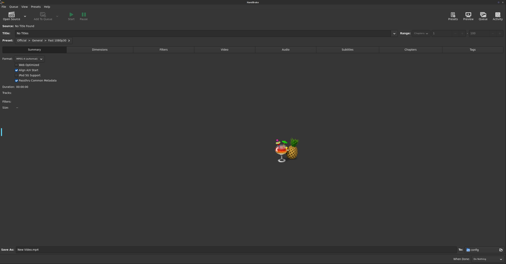

<p align="center">
  <picture>
    <source media="(prefers-color-scheme: dark)" srcset="https://raw.githubusercontent.com/junkerderprovinz/handbrake/main/.github/assets/handbrake-banner-dark.png">
    
  </picture>
</p>

<p align="center">
  <a href="https://github.com/junkerderprovinz/handbrake/actions/workflows/build.yml"></a>&nbsp;
  <a href="https://github.com/junkerderprovinz/handbrake/actions/workflows/lint.yml"></a>&nbsp;
  <a href="https://hub.docker.com/r/junkerderprovinz/handbrake"></a>&nbsp;
  <a href="https://hub.docker.com/r/junkerderprovinz/handbrake"></a>&nbsp;
  <a href="https://github.com/junkerderprovinz/handbrake/pkgs/container/handbrake"></a>&nbsp;
  <a href="https://github.com/selkies-project/selkies"></a>&nbsp;
  <a href="https://unraid.net"></a>&nbsp;
  <a href="LICENSE"></a>
</p>

<br>

<p align="center">
A modern, plug-and-play Docker image for <b>HandBrake</b> on Unraid. The full
transcoder GUI in your browser via Selkies, <b>dark by default</b> using
HandBrake's own native GTK dark mode, plus a <b>watch-folder converter</b> that
transcodes anything you drop into <code>/watch</code> without opening the UI at
all. Everything is configurable from the Unraid template, no SSH or config-file
editing required.
</p>

<br>

<p align="center">Maintained solo, in whatever spare time there is. Bugs, ideas and feature requests via <a href="https://github.com/junkerderprovinz/handbrake/issues">GitHub issues</a>. If it's useful to you, a coffee is always welcome.</p>

<p align="center">
  <a href="https://buymeacoffee.com/junkerderprovinz">
    
  </a>
</p>

<br>

## Table of Contents

1. [Overview](#1-overview)
2. [Screenshots](#2-screenshots)
3. [Quick Start](#3-quick-start)
4. [Volumes and Ports](#4-volumes-and-ports)
5. [Configuration](#5-configuration)
6. [Automated Watch-Folder Conversion](#6-automated-watch-folder-conversion)
7. [Dark Mode](#7-dark-mode)
8. [Hardware Encoding](#8-hardware-encoding)
9. [Conversion Hooks](#9-conversion-hooks)
10. [Web Desktop Features](#10-web-desktop-features)
11. [Running More Than One Instance](#11-running-more-than-one-instance)
12. [Optical Drives](#12-optical-drives)
13. [Migrating from jlesage/handbrake](#13-migrating-from-jlesagehandbrake)
14. [Building Locally](#14-building-locally)
15. [Troubleshooting](#15-troubleshooting)
16. [License](#16-license)
17. [Support this project](#17-support-this-project)

<br>

## 1. Overview

This image packages [HandBrake](https://handbrake.fr) — the open-source video
transcoder — into a self-contained Docker container that runs in any modern web
browser. It is built on
[`linuxserver/baseimage-selkies`](https://github.com/linuxserver/docker-baseimage-selkies),
so it inherits LSIO's actively maintained Selkies desktop-streaming stack (a
hybrid VNC/H.264 pipeline) and weekly security updates, while everything
HandBrake-specific is layered on top here.

What you get beyond bare HandBrake:

- **Selkies instead of noVNC** — a hybrid VNC/H.264 pipeline for a smooth web
  desktop, real bidirectional browser clipboard, native file upload and
  download, high-DPI ready
- **Dark by default** — HandBrake's own native GTK dark mode, not a repaint;
  switch to light with one variable
- **Watch-folder automation** — drop a file into `/watch`, get a transcode in
  `/output`, no GUI interaction
- **Atomic output** — conversions are written to a hidden `.partial` file and
  renamed on success, so a media scanner never indexes a half-written video
- **Multi-arch** — amd64 and arm64, both gated by a CI smoke test that really
  transcodes a clip before anything is published

| | **This image** | jlesage/handbrake |
|---|:---:|:---:|
| Web stack | **Selkies (WebRTC/H.264)** | noVNC |
| Base | Ubuntu (glibc) | Alpine (musl) |
| NVIDIA NVENC encoding | ✅ | ❌ ([open since 2019](https://github.com/jlesage/docker-handbrake/issues/49)) |
| Intel Quick Sync (QSV) encoding | ✅ verified | ⚠️ frequently broken ([#459](https://github.com/jlesage/docker-handbrake/issues/459), [#430](https://github.com/jlesage/docker-handbrake/issues/430), [#382](https://github.com/jlesage/docker-handbrake/issues/382), more) |
| AMD VCE encoding | wired, unverified (no AMD GPU to test on) | ❌ ([open request](https://github.com/jlesage/docker-handbrake/issues/441)) |
| Dark mode default | ✅ | opt-in via `DARK_MODE=1` |
| Watch-folder conversion | ✅ | ✅ |
| Browser clipboard | ✅ | ⚠️ |
| File upload via WebUI | ✅ | ❌ |
| Web file manager | ✅ on by default | opt-in via `WEB_FILE_MANAGER=1` |
| Conversion hooks | ✅ | ✅ |
| Staging on a separate disk | ✅ configurable | ❌ fixed under the output folder |
| Shared-watch-folder locking | ✅ | ✅ |
| CJK fonts | ✅ always | opt-in via `ENABLE_CJK_FONT=1` |
| Multi-arch | ✅ amd64 + arm64 | ✅ |
| Direct VNC client | ❌ (Selkies only, by design) | ✅ |

<br>

## 2. Screenshots

<p align="center">
  
</p>

<br>

## 3. Quick Start

Unraid: install from Community Applications and adjust the paths in the
template. Everything else has a working default.

Plain Docker:

```sh
docker run -d \
  --name=handbrake \
  -p 3000:3000 \
  -p 3001:3001 \
  -e PUID=99 \
  -e PGID=100 \
  -e TZ=Europe/Vienna \
  -v /mnt/user/appdata/handbrake:/config \
  -v /mnt/user/media:/storage:ro \
  -v /mnt/user/media/watch:/watch \
  -v /mnt/user/media/converted:/output \
  --restart unless-stopped \
  ghcr.io/junkerderprovinz/handbrake:latest
```

Then open `https://<host>:3001/`. Wait for `HANDBRAKE IS READY` in the container
log on the very first start.

<br>

## 4. Volumes and Ports

| Container path | Mode | Purpose |
|---|---|---|
| `/config` | rw | HandBrake presets, queue, logs and container state |
| `/storage` | ro | Media you want to browse from inside the GUI |
| `/watch` | rw | Watch folder — anything dropped here is converted automatically |
| `/watch2` … `/watch5` | rw | Additional watch folders (optional) |
| `/output` | rw | Where converted files are written |

| Port | Purpose |
|---|---|
| `3000` | WebUI over HTTP |
| `3001` | WebUI over HTTPS (self-signed by default) |

<br>

## 5. Configuration

| Variable | Default | Description |
|---|---|---|
| `PUID` / `PGID` | `911` | User and group the container runs as (Unraid: `99` / `100`) |
| `UMASK` | `022` | File-mode mask for everything the container creates |
| `TZ` | `Etc/UTC` | Container timezone |
| `LANG` | `en_US.UTF-8` | Locale, also drives HandBrake's UI language |
| `HANDBRAKE_THEME` | `dark` | `dark` or `light` — see [Dark Mode](#7-dark-mode) |
| `APP_NICENESS` | `0` | `nice` level (0-19) for the GUI and every transcode |
| `KEYBOARD_LAYOUT` | `us` | X keyboard layout loaded at session start |
| `GPU_VENDOR` | `none` | `none`, `nvidia`, `intel` or `amd` — see [Hardware Encoding](#8-hardware-encoding) |
| `CUSTOM_USER` / `PASSWORD` | empty | Set both to require a login on the WebUI; empty means no login |
| `CUSTOM_PORT` / `CUSTOM_HTTPS_PORT` | `3000` / `3001` | Internal WebUI ports |

<br>

## 6. Automated Watch-Folder Conversion

Every file dropped into `/watch` (and `/watch2`…`/watch5` when mounted) is
transcoded with the configured preset and written to `/output`. The variable
names match `jlesage/handbrake` so existing template values keep working.

| Variable | Default | Description |
|---|---|---|
| `AUTOMATED_CONVERSION` | `1` | Set to `0` to disable the daemon entirely |
| `AUTOMATED_CONVERSION_PRESET` | `General/Very Fast 1080p30` | HandBrake preset, `category/name` |
| `AUTOMATED_CONVERSION_FORMAT` | `mp4` | Output container: `mp4`, `mkv` or `webm` |
| `AUTOMATED_CONVERSION_KEEP_SOURCE` | `1` | `0` deletes the source after a successful conversion |
| `AUTOMATED_CONVERSION_VIDEO_FILE_EXTENSIONS` | (built-in list) | Space-separated extensions to pick up |
| `AUTOMATED_CONVERSION_WATCH_DIR` | `AUTO` | `AUTO` scans `/watch`…`/watchN`; any other value is used as the single watch folder |
| `AUTOMATED_CONVERSION_MAX_WATCH_FOLDERS` | `5` | How many `/watchN` folders `AUTO` looks for |
| `AUTOMATED_CONVERSION_OUTPUT_DIR` | `/output` | Destination folder |
| `AUTOMATED_CONVERSION_OUTPUT_SUBDIR` | empty | A fixed subfolder, or `SAME_AS_SRC` to mirror the source tree |
| `AUTOMATED_CONVERSION_OVERWRITE_OUTPUT` | `0` | `1` overwrites an existing output file |
| `AUTOMATED_CONVERSION_SOURCE_STABLE_TIME` | `5` | Seconds a file must stop changing before it is picked up |
| `AUTOMATED_CONVERSION_CHECK_INTERVAL` | `5` | Seconds between watch-folder scans |
| `AUTOMATED_CONVERSION_HANDBRAKE_CUSTOM_ARGS` | empty | Extra `HandBrakeCLI` arguments appended to every job |
| `AUTOMATED_CONVERSION_STAGING_DIR` | empty | Where in-progress conversions are written. Empty means `<output>/.handbrake-staging` |
| `AUTOMATED_CONVERSION_IGNORE_DIRECTORIES` | empty | Space-separated directory basenames pruned from every watch-folder scan, matched anywhere in the tree |
| `AUTOMATED_CONVERSION_ACTIVE_HOURS` | empty | Restrict conversion to a daily window, `HH-HH` (24h clock, e.g. `22-06` for overnight only). Empty means always active. Uses the container's `TZ` (default `Etc/UTC`), so set `TZ` first if the window should follow your local time |

How it behaves:

- A file is only converted once it has been **stable** for
  `AUTOMATED_CONVERSION_SOURCE_STABLE_TIME` seconds, so a file still being
  copied in is never touched.
- Output is written into the **staging directory** and only moved to its final
  place after `HandBrakeCLI` succeeds, so a media scanner watching `/output`
  never sees a half-written file. By default the staging directory is a hidden
  folder under the output root (`<output>/.handbrake-staging`). Map `/staging`
  to a cache pool and set `AUTOMATED_CONVERSION_STAGING_DIR=/staging` to keep the
  array out of the write path while a transcode runs. When staging and output are
  on different filesystems the finished file is copied to a hidden sibling inside
  the output folder first and then renamed, so the last step stays atomic.
- If the staging directory cannot be written, the daemon says so loudly and
  refuses to convert anything instead of failing every file one by one. The GUI
  keeps working.
- Processed sources are remembered in
  `/config/handbrake/watch-state/done.list` by path, size and mtime — an
  unchanged source is never converted twice, an edited or re-copied one is.
- A failed job is recorded in `failed.list` and is not retried until the source
  changes. The full `HandBrakeCLI` output for every job is in
  `/config/handbrake-watch.log`.

<br>

## 7. Dark Mode

`HANDBRAKE_THEME=dark` (the default) applies HandBrake's own native GTK dark
mode — the stock Adwaita dark theme that ships inside GTK 4, exactly what
HandBrake uses on any Linux desktop set to dark. Nothing is repainted or
restyled. `HANDBRAKE_THEME=light` switches to the light variant.

One consequence worth knowing: the container sets `GTK_THEME`, which GTK reads
before it looks at any in-app preference. HandBrake's own light/dark toggle in
the UI therefore has no visible effect here — `HANDBRAKE_THEME` is the single
source of truth. Change it in the template and restart the container.

<br>

## 8. Hardware Encoding

Set `GPU_VENDOR` and pass the device through; the watch-folder converter then
adds `--encoder <hardware encoder>` to every job. The GUI is unaffected and
keeps its own encoder dropdown. This is the feature the Alpine-based
community image has never been able to ship at all: NVIDIA's userspace
libraries are glibc binaries that musl cannot load, so its NVENC request has
been [open since 2019](https://github.com/jlesage/docker-handbrake/issues/49).
This image is Ubuntu-based, so the standard container runtimes just work.

| `GPU_VENDOR` | What you need on the host | Works out of the box | Verified by the maintainer |
|---|---|---|---|
| `none` (default) | nothing | ✅ software x264/x265 | ✅ |
| `nvidia` | `--runtime=nvidia`, the Nvidia-Driver plugin | ✅ | ✅ real hardware, RTX 4070 Ti SUPER |
| `intel` | `/dev/dri` passthrough, `i915` or `xe` kernel driver | ❌ [known Ubuntu-packaging bug](#intel-quick-sync-qsv) | ✅ real hardware, bug found and fixed (`handbrake:gpu-full`) |
| `amd` | `/dev/dri` passthrough, `amdgpu` kernel driver, a custom image, AMD's AMF runtime | ❌ see below | ❌ no AMD GPU here |

The container never pretends. If the encoder you asked for is not usable it
falls back to software and writes the reason into the container log, plus a
full report to `/config/handbrake-gpu.log`.

### NVIDIA NVENC

`GPU_VENDOR=nvidia` encodes every watch-folder job on an NVIDIA GPU using
HandBrake's NVENC encoder instead of the CPU.

**Status:** developer-verified on real hardware (NVIDIA GeForce RTX 4070 Ti
SUPER, Unraid).

#### What the host needs

| Requirement | Value |
|---|---|
| Unraid plugin | **Nvidia-Driver** (ich777), from Community Applications |
| Extra Parameters | `--runtime=nvidia` |
| `NVIDIA_VISIBLE_DEVICES` | a GPU UUID from `nvidia-smi -L` on the host, or `all` |
| `NVIDIA_DRIVER_CAPABILITIES` | `compute,video,utility` (or `all`) |
| `GPU_VENDOR` | `nvidia` |

`NVIDIA_DRIVER_CAPABILITIES` matters more than it looks: with the variable unset
the NVIDIA runtime defaults to `utility,compute`, which does **not** include
`video` — and `video` is the capability that injects `libnvidia-encode.so.1`,
the library NVENC actually calls.

Plain Docker:

```sh
docker run -d \
  --name=handbrake \
  --runtime=nvidia \
  -e NVIDIA_VISIBLE_DEVICES=all \
  -e NVIDIA_DRIVER_CAPABILITIES=compute,video,utility \
  -e GPU_VENDOR=nvidia \
  -p 3000:3000 -p 3001:3001 \
  -e PUID=99 -e PGID=100 -e TZ=Europe/Vienna \
  -v /mnt/user/appdata/handbrake:/config \
  -v /mnt/user/media/watch:/watch \
  -v /mnt/user/media/converted:/output \
  --restart unless-stopped \
  ghcr.io/junkerderprovinz/handbrake:latest
```

#### What it changes

- **Watch-folder jobs only.** `GPU_VENDOR` adds `--encoder nvenc_h264` to every
  automated conversion. In the GUI you pick the encoder yourself — the NVENC
  entries appear in HandBrake's own encoder list as soon as the GPU is passed in.
- **H.264 by default, on purpose.** The default preset is an x264 preset, so
  `nvenc_h264` keeps the delivered codec identical and only swaps the encoder.
  For HEVC, set
  `AUTOMATED_CONVERSION_HANDBRAKE_CUSTOM_ARGS=--encoder nvenc_h265` — custom args
  are appended last, so they win. `nvenc_av1` and `nvenc_av1_10bit` are compiled
  in too (confirmed in `docs/hardware-encoding-nvidia.md`); the watch-folder seam
  does not pick AV1 automatically since not every player supports it yet, but
  `--encoder nvenc_av1` works the same way.
- **A HandBrake hardware preset is left alone.** If
  `AUTOMATED_CONVERSION_PRESET` already names an NVENC preset, the container does
  not override its encoder.
- **Speed presets.** NVENC does not understand x264 speed names such as
  `veryfast`; HandBrake substitutes its own default. To control the tradeoff
  yourself, add `--encoder-preset <name>` to the custom args — the valid names
  are listed by
  `docker exec handbrake HandBrakeCLI --encoder-preset-list nvenc_h264`.
- **Hardware decoding (NVDEC) stays off.** HandBrake disables hardware decoding
  as soon as any filter runs, and every stock preset crops or scales, so it would
  buy nothing by default. Force it with
  `AUTOMATED_CONVERSION_HANDBRAKE_CUSTOM_ARGS=--enable-hw-decoding nvdec` if your
  preset has no filters.

The measured details for this build, including the NVENC encoders it offers on
a working GPU and the hardware evidence behind the "developer-verified" claim,
are in [`docs/hardware-encoding-nvidia.md`](docs/hardware-encoding-nvidia.md).

### Intel Quick Sync (QSV)

Requirements on the host:

- The iGPU or Arc card passed into the container. Unraid: add `--device=/dev/dri`
  to *Extra Parameters*. Plain Docker: `--device /dev/dri`.
- The **open-source** `i915` (or `xe`) kernel driver, which every current Linux
  kernel ships. No proprietary driver, no vendor container toolkit, nothing to
  install on the host.

```sh
docker run -d \
  --name=handbrake \
  --device /dev/dri \
  -e GPU_VENDOR=intel \
  ... \
  ghcr.io/junkerderprovinz/handbrake:latest
```

On the next start the log says which encoder was chosen:

```
[handbrake-gpu] Intel QSV enabled: --encoder qsv_h264 (render node /dev/dri/renderD128)
```

**Important: the default image's QSV detection is correct, but the encode
itself currently fails.** This was measured on real Intel hardware (Intel UHD
770), not assumed: every conversion with the stock, apt-installed
`HandBrakeCLI` fails at the muxing step with "Application provided invalid,
non monotonically increasing dts to muxer". This is a confirmed bug in
Ubuntu's specific packaged build of HandBrake, independently reproduced by
another user on the identical environment
([HandBrake/HandBrake#7962](https://github.com/HandBrake/HandBrake/issues/7962)),
not a bug in this container or in HandBrake itself.

**The fix ships as an optional variant image.** Build `handbrake:gpu-full`
(`Dockerfile.gpu`, `just build-gpu-full`, 30-60 minutes on 8 cores, amd64
only, not published) — it rebuilds `HandBrakeCLI` from source with
`--enable-qsv`, which fixes the bug completely. Verified end to end: a 180 s
1080p30 clip encodes in 12 s with `qsv_h264` on this hardware (27 s in
software on the same CPU), with no mux errors, and the output decodes
cleanly. Full measured evidence is in
[`docs/hardware-encoding-intel.md`](docs/hardware-encoding-intel.md).

```sh
docker build -f Dockerfile.gpu -t handbrake:gpu-full .
docker run -d \
  --name=handbrake \
  --device /dev/dri \
  -e GPU_VENDOR=intel \
  ... \
  handbrake:gpu-full
```

Notes worth knowing:

- The chosen encoder is `qsv_h264`, so the output codec matches what the default
  preset produces and stays as compatible as before. For HEVC, set
  `AUTOMATED_CONVERSION_HANDBRAKE_CUSTOM_ARGS=--encoder qsv_h265`; custom
  arguments are appended after the automatic ones and always win.
- Hardware *decoding* is not enabled automatically. Add
  `--enable-hw-decoding qsv` to `AUTOMATED_CONVERSION_HANDBRAKE_CUSTOM_ARGS` if
  you want it.
- Quality is preset-driven and the RF scale is not identical between x264 and
  QSV, so expect a different file size at the same nominal quality.
- Quick Sync is x86-64 only. On arm64 the variable is accepted and ignored, with
  a log line saying so.
- Which encoders your specific GPU generation actually supports (H.264/H.265
  are broadly supported; AV1 needs a newer generation) is logged by HandBrake
  itself at the start of every job — see
  [`docs/hardware-encoding-intel.md`](docs/hardware-encoding-intel.md) section 2.

### AMD VCE

**Honest summary: the stock image cannot do AMD hardware encoding, and this is
not something we can fix from inside the container.** Setting `GPU_VENDOR=amd`
is still worth doing, because it prints the exact reason and keeps converting in
software:

```
[handbrake-gpu] WARNING: GPU_VENDOR=amd and /dev/dri/renderD128 exists, but HandBrakeCLI offers neither vce_h264 nor vaapi_h264 here.
```

Why:

- HandBrake's AMD path on Linux is **VCE through AMD's AMF framework**. Ubuntu
  does not build HandBrake with `--enable-vce`, and upstream enables it by
  default only for Windows builds, so the packaged `HandBrakeCLI` contains no
  AMD encoder at all.
- Even a rebuilt binary needs AMD's proprietary AMF runtime
  (`libamfrt64.so.1`, from the `amf-amdgpu-pro` package on `repo.radeon.com`).
  That library is not redistributable here, and AMD no longer ships AMF as part
  of the Linux driver stack. The last release covers **RDNA1 and RDNA2 only**
  (RX 5000 and RX 6000 series).
- HandBrake 1.11 has no VA-API fallback for AMD. VA-API encoders exist in
  upstream's development branch, so this is expected to change; when a base
  image update brings them, this container picks them up automatically, because
  it asks HandBrake which encoders exist instead of hardcoding names.

If you have an RX 5000/6000 series card and want to try anyway:

1. Install `amf-amdgpu-pro` on the host per AMD's instructions, and find the
   library: `dpkg -L amf-amdgpu-pro | grep amfrt`.
2. Build the variant image (amd64 only, expect 30 to 60 minutes; also fixes
   Intel QSV, see above):
   ```sh
   docker build -f Dockerfile.gpu -t handbrake:gpu-full .
   ```
3. Run it with the runtime mounted in and the device passed through:
   ```sh
   docker run -d \
     --name=handbrake \
     --device /dev/dri \
     -v /opt/amdgpu-pro/lib/x86_64-linux-gnu/libamfrt64.so.1:/usr/lib/x86_64-linux-gnu/libamfrt64.so.1:ro \
     -e GPU_VENDOR=amd \
     ... \
     handbrake:gpu-full
   ```
4. Check the log for `AMD hardware encoding enabled: --encoder vce_h264`. If it
   is not there, `/config/handbrake-gpu.log` says which piece is missing.

One more caveat, because it has caught people out: on cards newer than RDNA2 the
AMF runtime can report encoder capabilities and still encode on the CPU. If the
transcode runs at software speed, that is what is happening; there is no fix
available today other than waiting for HandBrake's VA-API encoders.

**AMD VCE is unverified.** There is no AMD GPU here to test the actual encode
on — see the Community Verification section below.

### What the container tells you

Every non-`none` `GPU_VENDOR` writes `/config/handbrake-gpu.log` on each start:
the render nodes and their permissions, the groups the container user is in, the
kernel driver behind each node, the encoders HandBrake really offers on your
machine, and `vainfo` / `vpl-inspect` output.

```sh
docker exec handbrake cat /config/handbrake-gpu.log
```

That file is the first thing to read when hardware encoding does not engage, and
the one thing to attach to a report.

The container never guesses an encoder name: at start-up it asks the bundled
`HandBrakeCLI` which encoders it can actually use on your GPU and picks from
that list, so a driver or GPU that cannot do the requested vendor is detected
instead of assumed.

```sh
docker logs handbrake 2>&1 | grep '\[handbrake-gpu\]'
docker exec handbrake cat /run/handbrake/gpu-args    # empty means software encoding
```

### Help us verify this (please)

**AMD VCE in this image is implemented against AMD's and HandBrake's own
documentation. It has not been verified on real hardware by the maintainer,
because there is no AMD GPU here to test on.** NVIDIA and Intel both have a
card behind them now — see the table above. Every part that could be tested
without AMD hardware has been: the runtime libraries are asserted in CI, the
encoder selection logic is exercised in CI on GPU-less runners, and the
fallback path is checked on both architectures.

What is missing is somebody with actual AMD hardware saying whether a file
comes out the other end faster — and, since Intel Quick Sync varies a lot by
GPU generation, a confirmation on hardware other than a Gen12/Xe iGPU
(older Gen9-11, or a discrete Arc card) is useful too.

If you have an AMD Radeon, or Intel hardware other than a Gen12+ iGPU:

1. Set `GPU_VENDOR=amd` (or `intel` with `handbrake:gpu-full`) and pass
   `--device /dev/dri`.
2. Convert one file.
3. Open a report with the hardware report form:
   [**Report your GPU result**](https://github.com/junkerderprovinz/handbrake/issues/new?template=hardware-report.yml)

Attach `/config/handbrake-gpu.log` and say whether it worked. A report that says
"it does not work" is just as useful as one that says it does, and the log file
usually contains the reason.

<br>

## 9. Conversion Hooks

Drop a shell script into `/config/hooks/` and the watch-folder daemon runs it at
the matching point. The folder is created on first start and always contains an
up-to-date `.example` for each hook; copy one and remove the `.example` suffix to
enable it. Hooks are executed with `/bin/sh` and their shebang is ignored, which
is the same contract `jlesage/handbrake` uses, so scripts written for that image
work here unchanged.

| Hook | When | Arguments |
|---|---|---|
| `pre_conversion.sh` | Before `HandBrakeCLI` starts on a file | `$1` output file, `$2` source file, `$3` preset |
| `post_conversion.sh` | After every attempt, once the file has reached its final path | `$1` status (`0` = success), `$2` output file, `$3` source file, `$4` preset |
| `post_watch_folder_processing.sh` | End of a scan pass that converted at least one file | `$1` watch folder |
| `hb_custom_args.sh` | Just before `HandBrakeCLI`, to add per-file arguments | `$1` source file, `$2` preset. Print the arguments on stdout |

The same values are also in the environment, which is usually easier to read:
`HB_INPUT`, `HB_OUTPUT`, `HB_STATUS`, `HB_PRESET`, `HB_FORMAT`, `HB_WATCH_DIR`.

Two behaviours worth knowing:

- **A non-zero exit from `pre_conversion.sh` refuses the file.** The conversion
  is skipped and the source is recorded in `failed.list`, so it is not retried
  until the file itself changes. Every other hook's exit code is logged and
  otherwise ignored.
- `hb_custom_args.sh` output is appended **after**
  `AUTOMATED_CONVERSION_HANDBRAKE_CUSTOM_ARGS`, so where both set the same flag
  the hook wins.

Everything a hook prints goes to `/config/handbrake-watch.log`.

**A fifth hook, `post_manual_conversion.sh`, covers conversions you start
yourself in the GUI**, not just the watch-folder daemon. It rides on
HandBrake's own "Send file to" preference (Preferences → When Done), which
this image wires up automatically, so there is nothing to configure beyond
copying the `.example` file. The contract is narrower, because it is genuinely
all HandBrake's GUI hands over: `$1` is the finished output file only, no
source path, no preset, and it only fires on a successful encode. This wiring
activates from the **second** container start onward — on a brand-new
`/config`, HandBrake has not created its own preferences file yet on the
first boot, and this image only ever patches an existing one rather than
overwriting HandBrake's real defaults.

<br>

## 10. Web Desktop Features

Most of what other HandBrake images expose through their own variables comes
straight from the Selkies desktop and needs no configuration at all.

| Variable | Default | Description |
|---|---|---|
| `WEB_FILE_MANAGER` | `1` | Serves the data folders at `https://<host>:3001/files/` for browsing, download and upload. `0` removes the endpoint and the sidebar panel |
| `WEB_FILE_MANAGER_ALLOWED_PATHS` | `AUTO` | `AUTO` publishes the watch folders, the output folder and `/storage`, whichever exist. Otherwise a comma-separated list of absolute paths |
| `WEB_FILE_MANAGER_DENIED_PATHS` | empty | Comma-separated paths inside the allowed ones that answer `403` |
| `WEB_TERMINAL` | `0` | `1` enables a terminal on the web desktop with **Ctrl+Alt+T**. `0` disables every terminal program in the container |
| `WEB_TERMINAL_SHELL_PATH` | `/bin/bash` | The shell that terminal opens |
| `WEB_NOTIFICATION` | `0` | `1` shows a popup on the web desktop when a conversion finishes or fails |

**File manager.** Upload a video in the browser and it lands in `/watch`, where
the watch-folder daemon picks it up; browse `/output` and download the result
without touching a share. `/config` is refused as an allowed path even if you ask
for it explicitly, because it holds the WebUI's TLS private key. If you expose
this container beyond your LAN, set `CUSTOM_USER` and `PASSWORD`.

**Terminal.** A keyboard shortcut rather than a separate web page: HandBrake's
window is maximised, so the desktop's right-click menu cannot be reached. The
terminal is a real window on the same desktop, streamed like everything else.

**Notifications** are shown by the desktop itself, in the corner of the HandBrake
tab. They are not browser or operating-system notifications, so you see them
while the tab is open rather than in the background. Their colours follow
`HANDBRAKE_THEME`.

**Clipboard** works in both directions out of the box, no variable required. It
needs the HTTPS port (`3001`): browsers only allow clipboard access on a secure
origin. Firefox additionally blocks the silent clipboard read the web client uses
on focus, which can lower-case pasted capitals; set
`dom.events.testing.asyncClipboard` to `true` in `about:config` if you hit that.

**Audio** works out of the box as well, so there is no variable for it. The
microphone path is switched off, since a transcoder has no use for one.

**CJK fonts** (Japanese, Korean, Chinese) are always installed. Nothing to enable,
and filenames or subtitle tracks in those scripts render correctly everywhere in
the UI.

**HTTPS** is always available on port `3001` with a self-signed certificate that
is generated on first start and kept in `/config/ssl`.

**Login** is off by default and switched on by setting `CUSTOM_USER` and
`PASSWORD`, which is the same pattern every container in this fleet uses.

<br>

## 11. Running More Than One Instance

Two independent containers, each with its own `/config`, watch folder and output
folder, need nothing special: no path outside `/config`, `/watch*`, `/output` and
`/staging` is shared, and everything else the container writes lives in its own
`/run`.

Two containers **sharing one watch folder** to convert twice as many files at
once also works. Each file is claimed with a lock directory in the watch folder,
so exactly one container converts it. Some ground rules:

- The watch folder must be **writable** by both containers. If it is read-only,
  locking is off, the log says so, and you must not point a second instance at it.
- Give each container its own `/config`. The conversion bookkeeping is per
  container; the lock is what keeps them from colliding.
- If both containers share one output folder, leave
  `AUTOMATED_CONVERSION_OVERWRITE_OUTPUT=0` (the default). A file the other
  container already converted is then simply skipped.
- Sharing one staging directory is fine. Every in-progress file carries the
  container's own tag, and on restart a container only cleans up its own
  leftovers.
- If a container is killed hard, its lock is cleared automatically the next time
  it starts. To clear one by hand: `rm -rf /path/to/watch/.handbrake-lock-*` while
  no conversion is running.

<br>

## 12. Optical Drives

> **Unverified.** The device plumbing is wired and the container is proven to run
> correctly when no drive is present, but no optical drive was available to test
> ripping end to end. Treat this section as best effort until somebody reports
> back. Reports very welcome.

Pass the drive in and HandBrake can use it as a source:

```sh
docker run -d \
  --name=handbrake \
  --device /dev/sr0 \
  -p 3000:3000 \
  -p 3001:3001 \
  -e PUID=99 \
  -e PGID=100 \
  -v /mnt/user/appdata/handbrake:/config \
  -v /mnt/user/media/converted:/output \
  --restart unless-stopped \
  ghcr.io/junkerderprovinz/handbrake:latest
```

In Unraid, add `--device /dev/sr0` under **Extra Parameters**. The container adds
itself to the group that owns the device automatically, so no permission changes
on the host should be needed. Open the drive from the GUI with **Open Source**
and browse to `/dev/sr0`.

ISO images, DVD folders containing `VIDEO_TS` and Blu-ray folders containing
`BDMV` also work as ordinary sources, and `.iso` files dropped into a watch
folder are picked up by the automatic converter like any other video.

Commercially encrypted DVDs are **not** supported: the container ships no
decryption library, and adding one is out of scope for this image.

<br>

## 13. Migrating from jlesage/handbrake

- Ports change: `5800`/`5900` become `3000` (HTTP) and `3001` (HTTPS). There is
  no direct VNC port — Selkies is the only access path, by design.
- All `AUTOMATED_CONVERSION*` variables keep their names and defaults, so you can
  copy those values over unchanged.
- `/config/hooks/` keeps its name and its argument order, so existing hook
  scripts work without edits.
- `/config`, `/storage`, `/watch` and `/output` keep their meaning, but the
  `/config` contents are not compatible: start with a fresh appdata folder and
  re-import your custom presets from the GUI.

Variables that changed, and why:

| jlesage | Here | Note |
|---|---|---|
| `USER_ID` / `GROUP_ID` | `PUID` / `PGID` | The LinuxServer convention this image is built on |
| `DARK_MODE=1` | `HANDBRAKE_THEME=dark` | Already the default |
| `WEB_AUTHENTICATION`, `_USERNAME`, `_PASSWORD` | `CUSTOM_USER`, `PASSWORD` | HTTP basic auth on the WebUI. `WEB_AUTHENTICATION_TOKEN_VALIDITY_TIME` has no counterpart: basic auth has no token to expire |
| `SECURE_CONNECTION=1` | (none) | HTTPS on port `3001` is always available |
| `WEB_HOST_CLIPBOARD_SYNC` | (none) | Clipboard sync is always on |
| `WEB_AUDIO` | (none) | Browser audio is always on. The microphone is off, which a transcoder has no use for |
| `ENABLE_CJK_FONT` | (none) | CJK fonts are always installed |
| `KEEP_APP_RUNNING` | (none) | The GUI is always restarted if it exits |
| `WEB_FILE_MANAGER*`, `WEB_TERMINAL*`, `WEB_NOTIFICATION` | same names | See [Web Desktop Features](#10-web-desktop-features). `WEB_FILE_MANAGER` defaults to `1` here, and `WEB_NOTIFICATION` shows its popups on the web desktop rather than as browser notifications |
| `VNC_PASSWORD`, `VNC_LISTENING_PORT`, `SECURE_CONNECTION_VNC_METHOD` | (none) | There is no VNC port |
| `AUTOMATED_CONVERSION_USE_TRASH`, `_TRASH_DIR` | (none) | Not implemented. `AUTOMATED_CONVERSION_KEEP_SOURCE=1` (the default) never deletes a source |
| `AUTOMATED_CONVERSION_NON_VIDEO_FILE_ACTION`, `_NON_VIDEO_FILE_EXTENSIONS` | (none) | Not implemented. Non-video files in a watch folder are ignored |
| `AUTOMATED_CONVERSION_SOURCE_MIN_DURATION`, `_SOURCE_MAIN_TITLE_DETECTION` | (none) | Not implemented. Disc sources convert their first title |
| `AUTOMATED_CONVERSION_NO_GUI_PROGRESS` | (none) | The watch daemon never draws in the GUI, so there is nothing to hide |
| `INSTALL_PACKAGES`, `PACKAGES_MIRROR` | (none) | Build a derived image instead |

<br>

## 14. Building Locally

```sh
git clone https://github.com/junkerderprovinz/handbrake.git
cd handbrake
docker build -t handbrake:dev .
docker run -d --name hb -p 3000:3000 -p 3001:3001 handbrake:dev
```

`just check` runs the same lint chain as CI. `just smoke` builds and boots the
image; `just convert-test` drops a generated clip into its watch folder.

<br>

## 15. Troubleshooting

**The WebUI is black on the first start.** The desktop is up before HandBrake
has drawn its window. Wait for `HANDBRAKE IS READY` in `docker logs handbrake`.

**Nothing in `/watch` gets converted.** Check `docker logs handbrake` for
`[handbrake-watch]` lines. The most common cause is a watch or output folder the
container user cannot write — the init log says so explicitly:
`WARNING: watch folder /watch is NOT writable by the container user`. Fix the
share owner on the host (`chown nobody:users /mnt/user/<share>`).

**A conversion failed.** The full `HandBrakeCLI` output is in
`/config/handbrake-watch.log`. The source is recorded in
`/config/handbrake/watch-state/failed.list` and is not retried until the file
changes; delete the line to retry it.

**The UI is light although `HANDBRAKE_THEME=dark`.** Confirm the variable
reached the process:

```sh
docker exec handbrake sh -c 'cat /proc/$(pgrep -x ghb)/environ | tr "\0" "\n" | grep GTK_THEME'
```
It must print `GTK_THEME=Adwaita:dark`.

**`GPU_VENDOR=nvidia` but the log says "no /dev/nvidia* device node".** The
container was not started through the NVIDIA runtime. Add `--runtime=nvidia` to
Extra Parameters and set `NVIDIA_VISIBLE_DEVICES` to a UUID from `nvidia-smi -L`
(Unraid needs the Nvidia-Driver plugin installed first). Conversions keep running
in software until then.

**The log says `libnvidia-encode.so.1` is missing.** The GPU is passed in but the
driver capabilities are too narrow. Set
`NVIDIA_DRIVER_CAPABILITIES=compute,video,utility`; the default of the NVIDIA
runtime leaves `video` out, and `video` is what injects the encoder library.

**The log says HandBrakeCLI "offers none of" the NVENC encoders.** The GPU and
the driver library are both there, but HandBrake itself will not use NVENC on
this machine. HandBrake only lists a hardware encoder it can currently use, so
the usual cause is an NVIDIA driver older than HandBrake's minimum — update the
Nvidia-Driver plugin. The log line `Encoders HandBrakeCLI offers here:` shows
exactly what it did find.

**NVENC is on but the files are still slow.** Check which encoder ran:

```sh
grep -i nvenc /mnt/user/appdata/handbrake/handbrake-watch.log | tail -n 5
```

If the job log names a software encoder, your preset is a hardware preset the
container deliberately did not override, or your custom args set `--encoder`
themselves — custom args are applied last and win.

**`/files/` is empty or returns 404.** Check the startup log:
`docker logs handbrake 2>&1 | grep handbrake-web`. Every published folder is
listed there as `/files/<name>/ -> <path>`. A folder that is not mounted is not
published. If a path was refused, the log says why.

**A conversion never starts and the log mentions the staging directory.** The
staging directory is not writable. Fix the owner of the mapped host folder
(`chown nobody:users /mnt/user/<share>`) or point
`AUTOMATED_CONVERSION_STAGING_DIR` somewhere writable.

**Ctrl+Alt+T does nothing.** Confirm `WEB_TERMINAL=1` and look for
`terminal keybind installed` in `docker logs handbrake`. Some browser extensions
capture the shortcut before the page sees it; try another browser or a private
window.

**A file in a shared watch folder is never converted.** A lock left behind by a
container that no longer exists blocks it. With no conversion running:

```sh
rm -rf /mnt/user/<watch-share>/.handbrake-lock-*
```

**A hook does not run.** It must be at `/config/hooks/<name>.sh` without the
`.example` suffix, and readable by the container user. Its output and any error
are in `/config/handbrake-watch.log`.

**Which image am I actually running?**

```sh
docker exec handbrake cat /etc/handbrake-build
```

<br>

## 16. License

This wrapper is AGPL-3.0-only (see [`LICENSE`](LICENSE)). HandBrake itself is
GPL-2.0 and its artwork is CC BY-SA 4.0 — every bundled component and its
licence is listed in [`NOTICE`](NOTICE).

<br>

## 17. Support this project

Questions, bugs, ideas or feature requests? Please [open a GitHub issue](https://github.com/junkerderprovinz/handbrake/issues).

This is a one-person project. I put a lot of time and effort into building and maintaining it, in whatever free time I have. If it's helped you, I'd genuinely appreciate the support: you're welcome to buy me a coffee.

<p align="center">
  <a href="https://buymeacoffee.com/junkerderprovinz">
    
  </a>
</p>
