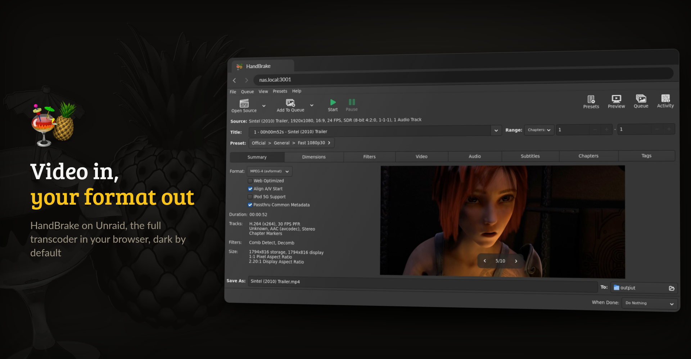
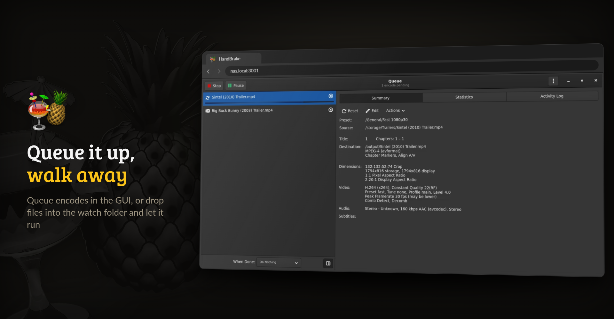

<p align="center">
  <picture>
    <source media="(prefers-color-scheme: dark)" srcset="https://raw.githubusercontent.com/junkerderprovinz/handbrake/main/.github/assets/handbrake-banner-dark.png">
    
  </picture>
</p>

<p align="center">
  <a href="https://github.com/junkerderprovinz/handbrake/actions/workflows/build.yml"></a>&nbsp;
  <a href="https://github.com/junkerderprovinz/handbrake/actions/workflows/lint.yml"></a>&nbsp;
  <a href="https://hub.docker.com/r/junkerderprovinz/handbrake"></a>&nbsp;
  <a href="https://hub.docker.com/r/junkerderprovinz/handbrake"></a>&nbsp;
  <a href="https://github.com/junkerderprovinz/handbrake/pkgs/container/handbrake"></a>&nbsp;
  <a href="https://github.com/selkies-project/selkies"></a>&nbsp;
  <a href="https://unraid.net"></a>&nbsp;
  <a href="LICENSE"></a>
</p>

<br>

<p align="center">
A modern, plug-and-play Docker image for <b>HandBrake</b> on Unraid. The full
transcoder GUI in your browser via Selkies, <b>dark by default</b> using
HandBrake's own native GTK dark mode, plus a <b>watch-folder converter</b> that
transcodes anything you drop into <code>/watch</code> without opening the UI at
all. Everything is configurable from the Unraid template, no SSH or config-file
editing required.
</p>

<!-- download-buttons: written by scripts/gen_download_buttons.py -->
<p align="center">
  <a href="https://ca.unraid.net/apps/handbrake-0tbg4zd0dqg4id"></a>
  &nbsp;
  <a href="https://hub.docker.com/r/junkerderprovinz/handbrake/"></a>
  &nbsp;
  <a href="https://github.com/junkerderprovinz/handbrake/releases/latest"></a>
</p>
<!-- /download-buttons -->

<br>

<p align="center">
A one-knight job: I build it, keep it running, work through the issues and add what people ask for, until nothing is missing. It is free, with no accounts, no telemetry, no ads and no paid tier. No asterisk anywhere. Nothing readable ever leaves your own walls. Forged on evenings and weekends, with heart and stubbornness.
</p>

<p align="center">
If it has earned a place on your server or computer, toss a coin to your knight: it helps cover the costs and keeps the project alive. It also makes this knight's heart beat a little faster. Three ways below, whichever suits you.
</p>

<!-- give-buttons: written by scripts/gen_download_buttons.py -->
<p align="center">
  <a href="https://buymeacoffee.com/junkerderprovinz"></a>
  &nbsp;
  <a href="https://www.paypal.com/donate/?hosted_button_id=76FVV52TKXTUS"></a>
  &nbsp;
  <a href="https://junkerderprovinz.github.io/junkerderprovinz/"></a>
</p>
<!-- /give-buttons -->

<br>

## Table of Contents

1. [What it looks like](#1-what-it-looks-like)
2. [What it does](#2-what-it-does)
3. [How it compares](#3-how-it-compares)
4. [Getting started](#4-getting-started)
5. [How AI is used here](#5-how-ai-is-used-here)
6. [Support this project](#6-support-this-project)

<br>

## 1. What it looks like

The videos in these pictures are the trailers of Blender's open movies Sintel and Big Buck Bunny (CC BY 3.0, Blender Foundation), loaded in a test container.

<p align="center">
  
  <br><em>HandBrake's own GTK dark mode, with a source loaded and the Fast 1080p30 preset picked</em>
</p>

<p align="center">
  
  <br><em>The queue works through one encode after another while you do something else</em>
</p>

<br>

## 2. What it does

- **Selkies instead of noVNC.** A hybrid VNC and H.264 stream for a smooth desktop, a real clipboard in both directions, and file upload and download from the browser.
- **Dark by default**, with HandBrake's own GTK dark mode rather than a repaint. One variable switches to light.
- **Watch-folder conversion.** Drop a file into `/watch` and the transcode lands in `/output` without opening the GUI. Output is written to a hidden file first and renamed when it is done, so a media scanner never picks up a half-written video. [The watch folder](docs/configuration.md#automated-watch-folder-conversion)
- **Hardware encoding** with NVIDIA NVENC, and with Intel Quick Sync in a variant image. [Hardware encoding](docs/configuration.md#hardware-encoding)
- **Hooks, a web file manager and a terminal**, with the same variable names as jlesage/handbrake, so existing templates and hook scripts keep working. [Hooks](docs/configuration.md#conversion-hooks), [Web desktop](docs/configuration.md#web-desktop-features)
- **Multi-arch**: amd64 and arm64, both checked in CI by a smoke test that really transcodes a clip before anything is published.

<br>

## 3. How it compares

Another HandBrake container is also in Community Applications:
**[linuxserver/handbrake](https://github.com/linuxserver/docker-handbrake)**,
the official LinuxServer.io image. It builds on the very same
[Docker Baseimage Selkies](https://github.com/linuxserver/docker-baseimage-selkies)
project this image does, just the Arch Linux flavour of it instead of the
Ubuntu one, and opts into that base's newer Wayland/PixelFlux screen-streaming
pipeline (`PIXELFLUX_WAYLAND=true`) rather than the classic X11 one this image
still uses by default. A strong, actively developed GUI, but no automated
conversion of any kind, so it does not compete on the feature this image is
built around.

| | **This image** | jlesage/handbrake | linuxserver/handbrake |
|---|:---:|:---:|:---:|
| Web stack | Selkies (X11) | noVNC | Selkies (Wayland) |
| Base | Ubuntu (glibc) | Alpine (musl) | Arch Linux |
| NVIDIA NVENC encoding | ✅ | ❌ [(#49)](https://github.com/jlesage/docker-handbrake/issues/49) | n/a |
| Intel Quick Sync (QSV) encoding | ✅ | ⚠️ [(#459)](https://github.com/jlesage/docker-handbrake/issues/459) | n/a |
| AMD VCE encoding | ⚠️ unverified | ❌ [(#441)](https://github.com/jlesage/docker-handbrake/issues/441) | n/a |
| Dark mode default | ✅ | opt-in (`DARK_MODE=1`) | ❓ |
| Watch-folder conversion | ✅ | ✅ | ❌ |
| Browser clipboard | ✅ | ⚠️ | ✅ |
| File upload via WebUI | ✅ | ❌ | ✅ |
| Web file manager | ✅ | opt-in (`WEB_FILE_MANAGER=1`) | ❌ |
| Conversion hooks | ✅ | ✅ | ❌ |
| Staging on a separate disk | ✅ | ❌ | n/a |
| Shared-watch-folder locking | ✅ | ✅ | n/a |
| CJK fonts | ✅ | opt-in (`ENABLE_CJK_FONT=1`) | ❓ |
| Multi-arch | ✅ | ✅ | ❌ amd64 only |
| Direct VNC client | ❌ | ✅ | ❌ |

✅ works · ❌ doesn't · ⚠️ present but limited · ❓ undocumented · n/a no automated conversion to accelerate/configure

<br>

## 4. Getting started

On Unraid, install HandBrake from [Community Applications](https://ca.unraid.net/apps/handbrake-0tbg4zd0dqg4id) and set the paths for your media, the watch folder and the output folder. Everything else has a working default.

Without Unraid:

```sh
docker run -d --name handbrake \
  -p 3001:3001 \
  -e PUID=99 -e PGID=100 \
  -v /path/to/appdata/handbrake:/config \
  -v /path/to/media:/storage:ro \
  -v /path/to/watch:/watch \
  -v /path/to/converted:/output \
  junkerderprovinz/handbrake:latest
```

Then open `https://<server-ip>:3001/` and accept the self-signed certificate once. On the very first start, wait for `HANDBRAKE IS READY` in the container log.

Every variable, the watch-folder settings, hardware encoding, hooks, optical drives, moving over from jlesage/handbrake and the known problems are in [docs/configuration.md](docs/configuration.md).

<br>

## 5. How AI is used here

One knight builds this, and AI is one of the tools I work with, the same way I work with an editor or a compiler. It helps me write code and documentation and it checks my work, and that saves me a good many evenings. It does not make the decisions, though. I read and understand everything before it ships, and if something here breaks, that is on me and not on the tool.

You do not have to take my word for it. The code is open and every release note is written by hand. The issue tracker shows how problems actually get handled, including the ones I got wrong the first time. If you find something that is not right, open an issue and I will look at it.

<br>

## 6. Support this project

Questions, bugs, ideas or feature requests? Please [open a GitHub issue](https://github.com/junkerderprovinz/handbrake/issues).

A one-knight job: I build it, keep it running, work through the issues and add what people ask for, until nothing is missing. It is free, with no accounts, no telemetry, no ads and no paid tier. No asterisk anywhere. Nothing readable ever leaves your own walls. Forged on evenings and weekends, with heart and stubbornness.

If it has earned a place on your server or computer, toss a coin to your knight: it helps cover the costs and keeps the project alive. It also makes this knight's heart beat a little faster. Three ways below, whichever suits you.

<!-- give-buttons: written by scripts/gen_download_buttons.py -->
<p align="center">
  <a href="https://buymeacoffee.com/junkerderprovinz"></a>
  &nbsp;
  <a href="https://www.paypal.com/donate/?hosted_button_id=76FVV52TKXTUS"></a>
  &nbsp;
  <a href="https://junkerderprovinz.github.io/junkerderprovinz/"></a>
</p>
<!-- /give-buttons -->

<br>

<sub>This wrapper is AGPL-3.0-only. HandBrake itself is GPL-2.0 and its artwork is CC BY-SA 4.0. Every bundled component and its licence is listed in <a href="NOTICE">NOTICE</a>.</sub>
